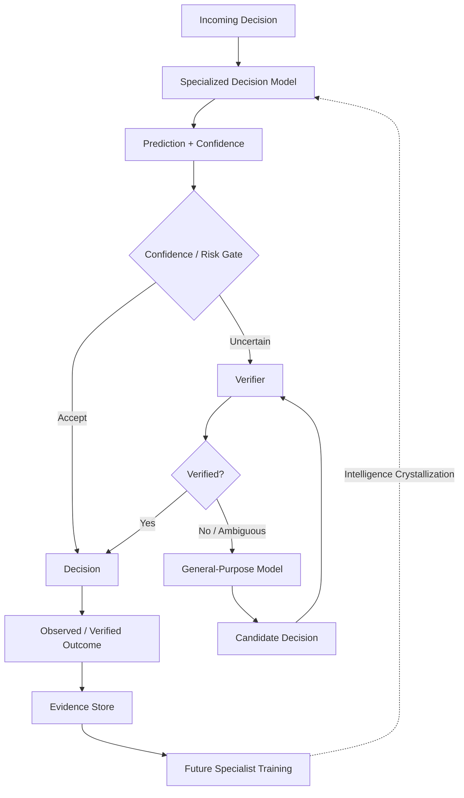
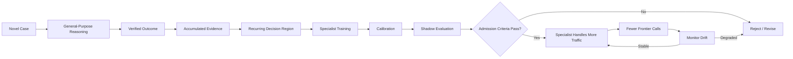
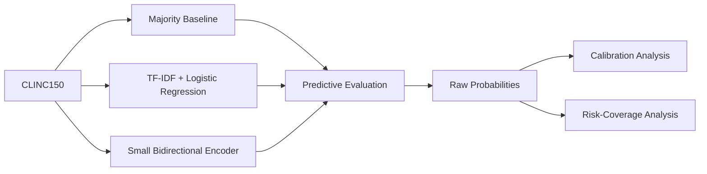
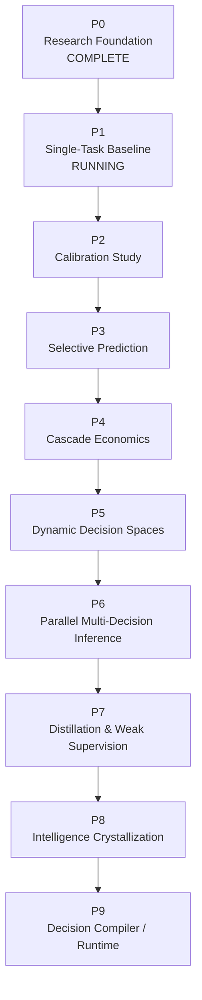

# TEMPER

[](#current-status)
[](https://www.python.org/)
[](https://docs.astral.sh/uv/)
[](#research-scope)
[](#evidence-and-reproducibility)

**TEMPER** is an experimental research program studying whether recurring bounded decisions currently handled by expensive general-purpose models can be progressively transferred into smaller, calibrated, verifiable decision models.

The project focuses on the system around the model—not benchmark accuracy alone.

Its central question is whether **specialization + calibrated abstention + independent verification + selective escalation** can lower cost and latency without sacrificing verified system-level reliability.

> **Research status:** P0 research foundation complete; P1 single-task baseline running.
> **Current experiment:** EXP-0001 — conventional decision baselines on CLINC150. B0/B1 validation executed; B2 is the next implementation target.
> **Thesis status:** hypothesis under investigation; not established. No TEMPER systems-thesis claim is supported yet.

---

## Research Thesis

> **Expensive general-purpose reasoning can, for recurring bounded decisions, be progressively compiled into smaller probabilistic decision models that deliver lower cost and latency while preserving system-level reliability through calibrated abstention, independent verification, and selective escalation.**

TEMPER treats this as a falsifiable hypothesis rather than an architectural assumption.

The stronger systems formulation asks whether a composed system:

```text
Specialist + Verifier + Escalation Policy + General-Purpose Model
```

can outperform direct use of a general-purpose model at a declared operating point with respect to:

* verified decision quality;
* inference cost;
* latency;
* throughput;
* compute requirements;
* calibration;
* observability;
* operational controllability.

---

## Core Research Question

**Under what conditions does a specialist + verifier + escalation system outperform direct frontier-model inference on cost per verified correct decision?**

TEMPER is specifically interested in repeated, bounded decision problems where:

* outputs can be explicitly enumerated or constrained;
* decision quality can be independently evaluated;
* uncertainty matters operationally;
* incorrect automation has measurable cost;
* repeated frontier-model reasoning may eventually become unnecessary.

---

## System Hypothesis



The intended research question is not whether a small model can classify something.

It is whether the **entire decision system** can reduce dependence on expensive reasoning while keeping risk measurable and bounded.

---

## Intelligence Crystallization

TEMPER uses **intelligence crystallization** as a working term for the following process:



The research problem is whether this loop produces a real economic and reliability advantage after accounting for:

* training;
* verification;
* calibration;
* escalation;
* monitoring;
* retraining;
* distribution shift;
* maintenance complexity.

---

## North-Star Metric

TEMPER's primary systems metric is:

### Cost Per Verified Correct Decision — CPVCD

$$
\mathrm{CPVCD} =
\frac{\mathrm{Total\ Declared\ System\ Cost}}
{\mathrm{Verified\ Correct\ Decisions}}
$$

The accounting boundary must always be stated.

Depending on the experiment, total system cost may include:

* specialist inference;
* verification;
* frontier-model escalation;
* external API calls;
* local compute;
* training amortization;
* monitoring;
* retraining.

A lower model inference cost does **not** by itself establish a lower CPVCD.

---

## Evaluation Dimensions

TEMPER separates several concepts that are commonly collapsed together:

```text
valid output
    !=
correct prediction
    !=
normalized probability
    !=
calibrated probability
    !=
safe automated action
```

### Predictive Quality

* accuracy;
* precision / recall / F1;
* task-specific utility;
* class-level error analysis.

### Probabilistic Quality

* negative log likelihood;
* multiclass Brier score;
* reliability diagrams;
* expected calibration error;
* class-conditional calibration;
* high-confidence error analysis.

ECE is treated as a descriptive summary, not proof of calibration.

### Selective Prediction

* coverage;
* selective risk;
* risk-coverage curves;
* coverage at fixed risk;
* risk at fixed coverage;
* high-confidence failure rate.

### Systems Performance

* median latency;
* p95 / p99 latency;
* throughput;
* model size;
* RAM / VRAM;
* model load time;
* preprocessing time;
* API cost;
* compute cost.

### Robustness

* out-of-scope behavior;
* domain shift;
* temporal shift where available;
* adversarial or controlled perturbations;
* calibration degradation under shift.

---

## Calibration and Abstention Are Separate Problems

TEMPER does not assume that the probability estimator with the best calibration also provides the best selective-routing signal.

Later experiments will compare confidence signals such as:

* raw maximum softmax probability;
* calibrated maximum probability;
* entropy;
* class margin;
* logit-derived confidence;
* model-specific OOD scores where appropriate.

This distinction is central to the project:

> **Probability calibration asks whether confidence values mean what they claim. Selective prediction asks whether those values rank safe and unsafe decisions well enough to automate selectively.**

---

## Evidence Hierarchy

TEMPER prefers evidence in the following order:

1. observed real-world outcome;
2. deterministic or formal verifier;
3. independently curated expert label;
4. established benchmark label with documented provenance;
5. multi-source weak supervision;
6. single-model pseudo-label;
7. model self-evaluation.

Lower-quality evidence may be useful for training.

It must not silently become higher-quality evaluation evidence.

---

## Evidence and Reproducibility

Every substantive experiment is expected to preserve enough information to reconstruct the result.


The experiment contract can record:

* experiment ID;
* phase and status;
* Git revision;
* dataset source and version;
* dataset hash where available;
* label provenance;
* model identity;
* model revision;
* tokenizer revision;
* hardware;
* split definition;
* preprocessing configuration;
* training objective;
* random seed;
* hyperparameters;
* software environment;
* calibration method;
* threshold-selection method;
* metrics;
* artifact locations;
* limitations;
* conclusion.

Failed and negative experiments are evidence and should be preserved.

---

## Experiment Status Vocabulary

| Status         | Meaning                                                          |
| -------------- | ---------------------------------------------------------------- |
| `PLANNED`      | Protocol exists; execution has not begun                         |
| `RUNNING`      | Experiment is currently executing                                |
| `COMPLETE`     | Protocol completed and evidence is available                     |
| `REPLICATED`   | Result reproduced under declared replication conditions          |
| `NEGATIVE`     | Valid experiment did not support the hypothesis                  |
| `INCONCLUSIVE` | Evidence does not distinguish competing hypotheses               |
| `INVALIDATED`  | Methodological or implementation failure prevents interpretation |

Completed experiments are not silently overwritten.

---

## Current Status

### P0 — Research Foundation

**Status: COMPLETE**

P0 established the experimental contract before substantive model development.

Completed work includes:

* research thesis and null hypotheses;
* evaluation protocol;
* evidence policy;
* research-question registry;
* experiment registry;
* Pydantic experiment manifest;
* reproducible Python 3.12 / `uv` environment;
* security-oriented repository hygiene;
* calibration and selective-prediction metric kernel;
* deterministic unit tests;
* benchmark-selection criteria;
* CLINC150 selection;
* external research baseline record;
* predeclared EXP-0001 protocol.

The metric kernel currently includes:

* multiclass Brier score;
* negative log likelihood;
* expected calibration error;
* coverage;
* selective risk;
* risk-coverage curve construction.

No substantive model result is claimed by P0.

---

### P1 — Single-Task Baseline

**Status: RUNNING**

EXP-0001 is running on CLINC150.

Observed so far:

* dataset acquisition is reproducible;
* the seed-42 split is frozen;
* B0 (majority baseline) validation has been executed;
* B1 (TF-IDF + logistic regression) validation has been executed.

Not yet done:

* B2 (small bidirectional encoder) is the next implementation target and has not been evaluated;
* calibration has not been fitted;
* no threshold has been selected;
* final-test evaluation has not occurred.

B0/B1 validation evidence does not support a TEMPER systems-thesis claim.

---

## Current Experiment

### EXP-0001 — Conventional Decision Baseline on CLINC150

**Status: RUNNING**

B0 and B1 have been executed on the frozen validation partition. B2 is the next implementation target. Final-test evaluation has not occurred. Calibration has not been fitted.

Prepare the canonical UCI download and immutable seed-42 split metadata with
`uv run python experiments/EXP-0001/prepare.py`. Raw data is intentionally ignored by Git.

The first experiment establishes how far conventional classification gets before TEMPER introduces calibration-aware training, abstention policies, model cascades, or frontier escalation.

Initial comparison:



### Primary Outcome

* macro F1 on in-scope intent classification.

### Secondary Measurements

* accuracy;
* negative log likelihood;
* Brier score;
* raw confidence;
* latency;
* throughput;
* model size.

### Important Constraint

The final test split is not used for:

* model selection;
* hyperparameter tuning;
* early stopping;
* calibration fitting;
* threshold selection.

### Observed B0/B1 validation evidence

These measurements are **validation-partition results**. They are not final-test results. They are not calibrated probabilities. They do not measure OOD performance, selective-automation reliability, encoder or frontier superiority, CPVCD, or the TEMPER systems thesis.

Observed dataset provenance:

* `archive_sha256`: `0d8ecc3e1edd7b25cabde0177544ce536ddf773844bc80ef1a75f36e7f030ea2`
* `canonical_sha256`: `fb3217519e3c601c7a9b019dfd6744bed8f2564833e2b7eac4a406cacb462489`
* frozen split: `experiments/EXP-0001/splits/clinc150-full-seed-42.json`
* seed = 42
* train = 15,000
* validation = 1,500
* calibration = 1,500
* test = 4,500
* B0/B1 producer revision: `d4cf036244607ab4f88a7c880628f1a046bf8f5f`

| Baseline | Partition | n | accuracy | macro F1 | NLL | multiclass Brier |
| -------- | --------- | - | -------- | -------- | --- | ---------------- |
| B0 majority | validation | 1,500 | 0.006666666666666667 | 8.830022075055188e-05 | 27.446814308489024 | 1.9866666666666666 |
| B1 TF-IDF + logistic regression | validation | 1,500 | 0.8873333333333333 | 0.8863992084286425 | 1.07091089590222 | 0.36105027523628147 |

Observed B1 runtime on the same validation partition (`n_examples = 1500`):

* `fit_seconds` = 2.442327100000057
* `inference_seconds` = 0.009108400000059191

B2 has not been implemented or evaluated.

---

## Why CLINC150?

CLINC150 was selected because it provides:

* 150 bounded intent classes;
* 10 domains;
* explicit out-of-scope examples;
* established benchmark provenance;
* manageable local-compute requirements;
* fixed train / validation / test structure;
* a natural path toward later abstention and OOD experiments.

TEMPER does **not** treat success on CLINC150 as evidence that the thesis generalizes to production systems.

Cross-domain replication is required.

See:

* `docs/adr/0002-initial-dataset-criteria.md`
* `docs/adr/0003-select-clinc150.md`

---

## Research Roadmap



Later phases are **stage-gated**.

A roadmap item is not automatically admitted merely because it appears here.

### P1 — Single-Task Baseline

Establish conventional classifier performance.

### P2 — Calibration Study

Compare raw cross-entropy predictions, temperature scaling, Brier-oriented training, and selected alternatives.

### P3 — Selective Prediction

Study abstention, operating thresholds, confidence ranking, OOD behavior, and risk-coverage.

### P4 — Cascade Economics

Compare:

* specialist only;
* frontier only;
* specialist → frontier;
* specialist → verifier → frontier.

Introduce CPVCD as a systems outcome.

### P5 — Dynamic Decision Spaces

Investigate runtime-defined labels and semantic choices.

### P6 — Parallel Multi-Decision Inference

Study whether a state representation can be shared across multiple simultaneous decisions.

### P7 — Distillation and Weak Supervision

Introduce teacher-generated supervision only after real-label baselines are understood.

### P8 — Intelligence Crystallization

Test whether accumulated verified frontier decisions can be converted into reliable specialists.

### P9 — Decision Compiler / Runtime

Only after model behavior is sufficiently understood, investigate typed software contracts as declarations for learned inference.

---

## Null Hypotheses

TEMPER is explicitly designed to permit failure.

### H0.1

Specialized models do not materially reduce cost per verified correct decision after verification, retraining, monitoring, and escalation costs are included.

### H0.2

Calibration degrades too severely under distribution shift for confidence-based automation to remain useful.

### H0.3

Dynamic decision spaces remove enough specialization advantage that general-purpose generative models remain operationally superior.

### H0.4

Teacher-distilled specialists inherit teacher errors and cannot safely increase automated coverage without expensive external verification.

### H0.5

Maintenance complexity exceeds the compute savings produced by the decision system.

Evidence supporting any of these null hypotheses is considered a useful research result.

---

## Research Boundaries

TEMPER does **not** currently attempt to build:

* AGI;
* unrestricted recursive self-improvement;
* autonomous multi-agent systems;
* a general-purpose agent framework;
* a chatbot;
* a foundation model from scratch;
* a clone of TypeSafe Jev;
* an implementation based on undocumented RLCD internals;
* a production serving platform.

The project deliberately starts smaller.

---

## Repository Structure

```text
TEMPER/
├── docs/
│   ├── adr/
│   ├── agent-log/
│   ├── exec-plans/
│   │   ├── active/
│   │   └── completed/
│   ├── research/
│   ├── templates/
│   ├── EVALUATION_PROTOCOL.md
│   ├── EVIDENCE_POLICY.md
│   ├── EXPERIMENT_REGISTRY.md
│   ├── RESEARCH_QUESTIONS.md
│   ├── ROADMAP.md
│   └── THESIS.md
│
├── experiments/
│   └── EXP-0001/
│       ├── protocol.md
│       └── splits/
│
├── src/
│   └── temper/
│       ├── calibration/
│       ├── contracts/
│       ├── evaluation/
│       ├── evidence/
│       └── selective/
│
├── tests/
│   └── unit/
│
├── .python-version
├── .secrets.baseline
├── AGENTS.md
├── pyproject.toml
├── README.md
└── uv.lock
```

---

## Installation

TEMPER currently targets **Python 3.12** and uses [`uv`](https://docs.astral.sh/uv/) for environment and dependency management.

Clone the repository:

```bash
git clone https://github.com/jayjz/TEMPER.git
cd TEMPER
```

Create the environment and install development/security dependencies:

```bash
uv sync --group dev --group security
```

Run the test suite:

```bash
uv run pytest
```

Run quality gates:

```bash
uv run ruff check .
uv run ruff format --check .
uv run mypy src
uv run bandit -r src
uv run pip-audit
```

---

## Research Discipline

Changes that affect experimental interpretation should answer:

1. What hypothesis is being tested?
2. What evidence would falsify it?
3. Which dataset partition is being used?
4. Was the final test set touched?
5. Is the result predictive, probabilistic, selective, or systems-level?
6. What baseline is being compared?
7. Are raw outputs preserved?
8. What assumptions limit the claim?
9. Is the result local evidence or an external claim?
10. Can another person reproduce it?

---

## Security

Repository controls include:

* dependency auditing with `pip-audit`;
* static security scanning with Bandit;
* secret scanning with `detect-secrets`;
* exclusion of credentials, private datasets, model weights, caches, and generated security artifacts from Git.

Do not commit:

* API keys;
* credentials;
* private customer data;
* proprietary model weights;
* raw sensitive security artifacts;
* private datasets.

See `docs/EVIDENCE_POLICY.md`.

---

## Documentation

Core research documents:

| Document                                                                     | Purpose                                |
| ---------------------------------------------------------------------------- | -------------------------------------- |
| [`docs/THESIS.md`](docs/THESIS.md)                                           | Central hypothesis and null hypotheses |
| [`docs/ROADMAP.md`](docs/ROADMAP.md)                                         | Stage-gated research program           |
| [`docs/RESEARCH_QUESTIONS.md`](docs/RESEARCH_QUESTIONS.md)                   | Falsifiable research questions         |
| [`docs/EVALUATION_PROTOCOL.md`](docs/EVALUATION_PROTOCOL.md)                 | Evaluation and anti-leakage rules      |
| [`docs/EVIDENCE_POLICY.md`](docs/EVIDENCE_POLICY.md)                         | Claim and provenance requirements      |
| [`docs/EXPERIMENT_REGISTRY.md`](docs/EXPERIMENT_REGISTRY.md)                 | Durable experiment index               |
| [`docs/research/EXTERNAL_BASELINES.md`](docs/research/EXTERNAL_BASELINES.md) | External literature and claims         |
| [`experiments/EXP-0001/protocol.md`](experiments/EXP-0001/protocol.md)       | Current experiment protocol            |
| [`docs/agent-log/AGENT_HANDOFF_LOG.md`](docs/agent-log/AGENT_HANDOFF_LOG.md) | Operational agent handoff log          |
| [`AGENTS.md`](AGENTS.md)                                                     | Repository engineering instructions    |

---

## Repository Topics

Suggested GitHub topics:

`machine-learning` · `ml-research` · `calibration` · `uncertainty-quantification` · `selective-prediction` · `model-cascades` · `efficient-ai` · `llm-routing` · `distillation` · `ood-detection` · `reproducible-research` · `ai-evaluation`

---

## Current Research State

| Phase                                  | Status       |
| -------------------------------------- | ------------ |
| P0 — Research Foundation               | **Complete** |
| P1 — Single-Task Baseline              | **Running**  |
| P2 — Calibration Study                 | Planned      |
| P3 — Selective Prediction              | Planned      |
| P4 — Cascade Economics                 | Planned      |
| P5 — Dynamic Decision Spaces           | Planned      |
| P6 — Parallel Multi-Decision Inference | Planned      |
| P7 — Distillation / Weak Supervision   | Planned      |
| P8 — Intelligence Crystallization      | Planned      |
| P9 — Decision Compiler / Runtime       | Conditional  |

---

## Project Principle

> **The objective is not to make small models look good. The objective is to discover where expensive reasoning is actually necessary—and where it can be safely replaced.**

---

## README Maintenance

The README is treated as part of the research record.

Each substantive commit should update this document when the commit changes:

* research phase or status;
* active experiment;
* supported claims;
* architecture;
* evaluation methodology;
* major dependencies;
* repository structure;
* completed milestones.

The README should describe the repository as it exists at the referenced commit, not as an aspirational future state.
